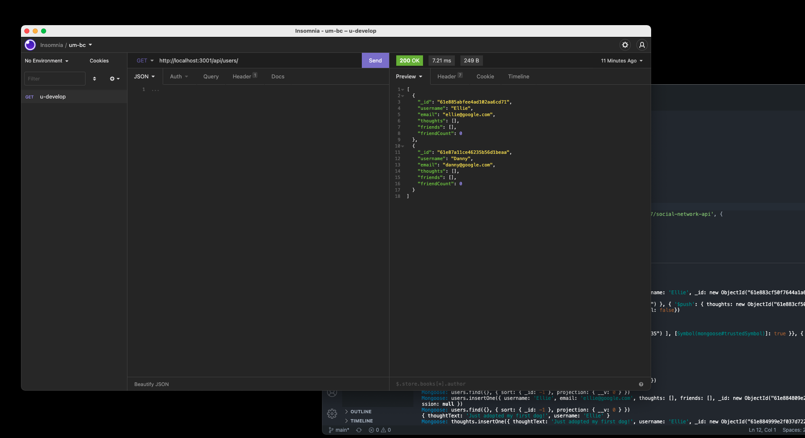

# Social Network API

## About this program

Social Network API is an api in which a social network company can use to create accounts, add friends, blog posts, and react to user's posts using these routes using mongoDB as storage. 

## Contributing
Hector Perez

## Built with

* Javascript
* node.js
* mongoDB
* mongoose
* npm packages 

### Questions
Contact me:

[Github](https://www.github.com/hpere102)  
[Email](mailto:hpere102@fiu.edu)